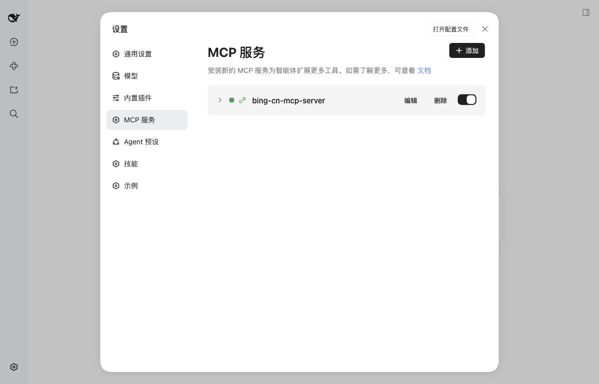
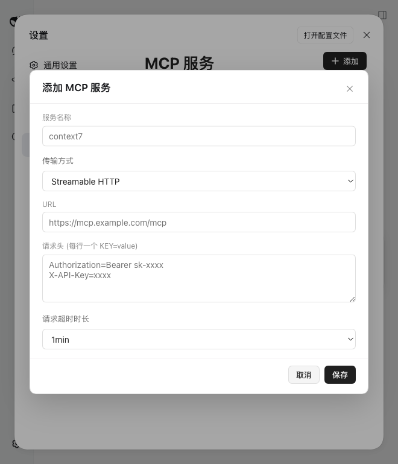
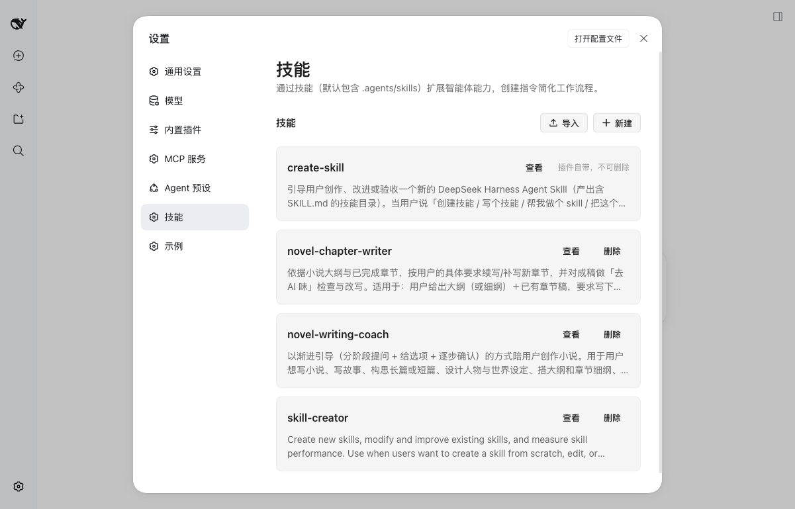
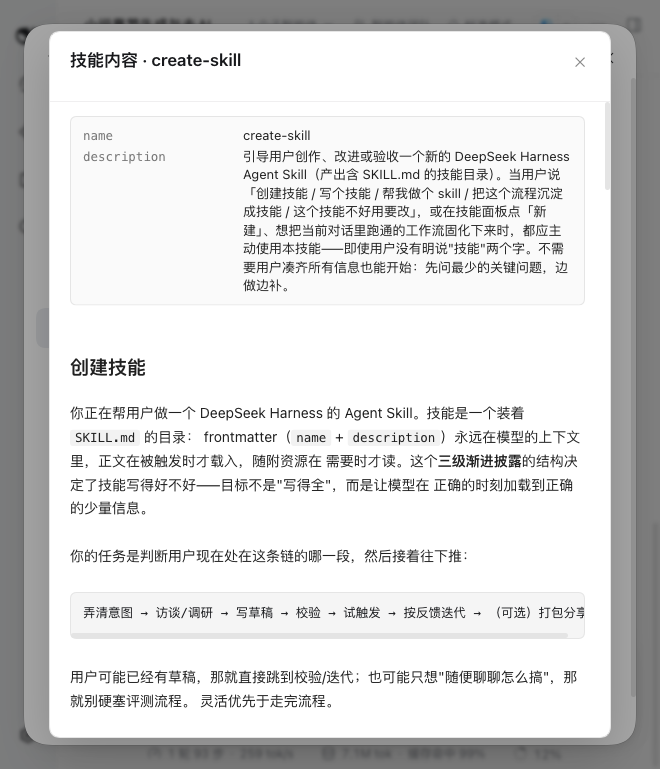
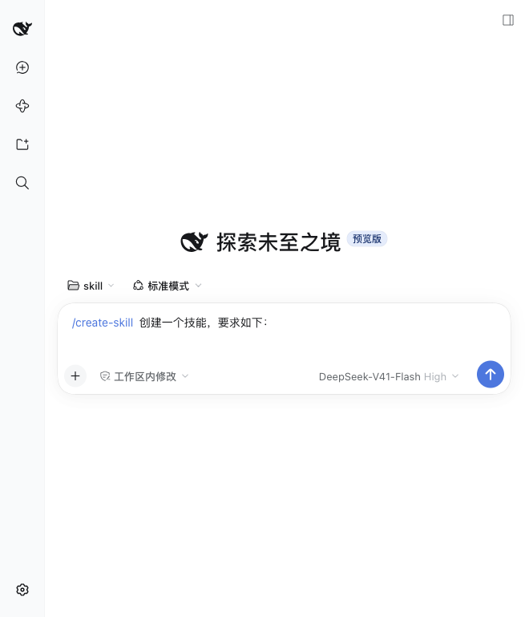

# dsh-pluginHive

[DeepSeek Harness](https://deepseek-harness.github.io/deepseek-harness/) 的自定义插件集合。
为 Web 设置页贡献两个管理面板，并提供一套可复制扩展的面板骨架。

| 包 | 设置页分区 | 能做什么 |
|---|---|---|
| [`@dsh-plugins/mcp-panel`](packages/mcp-panel) | **MCP 服务** | 添加 / 编辑 / 删除 / 启停 MCP 服务器，两种传输方式，自定义环境变量与请求头，展开查看 URL 与工具列表 |
| [`@dsh-plugins/skill-panel`](packages/skill-panel) | **技能** | 列举技能、阅读 `SKILL.md`（内置 Markdown 渲染）、导入 zip 技能包、删除技能、一键新建（自动开新会话并预填 `/create-skill`） |
| [`@dsh-plugins/bundled-skills`](packages/bundled-skills) | — | 随插件分发的技能内容（`create-skill`），首次挂载时自动引导到用户技能目录 |
| [`@dsh-plugins/plugin-kit`](packages/plugin-kit) | — | 共享基座：面板注册、Remote 代理、字典注册、自抄 UI 控件、零依赖 Markdown 渲染 |
| [`@dsh-plugins/example-panel`](packages/example-panel) | 示例 | 无 Remote 的最小面板骨架，**复制它即可开始写新面板** |

> 当前未发布到 npm，请从源码安装（见下）。

## 环境要求

- **DeepSeek Harness** `0.1.7-rc.2`（已验证）。面板依赖 harness 的 Cordis 插件框架与设置页插槽。
- **Node** `^22.19.0 || >=24.0.0`
- **pnpm** 11（仓库以 `packageManager: pnpm@11.7.0` 锁定）

## 安装

### 方式一：从源码安装（推荐）

```bash
git clone https://github.com/seanchen88/dsh-pluginHive.git
cd dsh-pluginHive
pnpm install
pnpm build                     # 产出各包的 lib/index.js 与 lib/client.js

# 把需要的面板装进当前 dsh profile
dsh plugin add ./packages/mcp-panel
dsh plugin add ./packages/skill-panel
```

`dsh plugin add` 会把包写入 profile 的依赖与 bundle 列表，插件自带的
`packages/*/cordis.patch.yml` 负责挂载宿主半，浏览器半由包内 `dsh.client` 声明被自动发现。
重新打开设置页即可看到「MCP 服务」「技能」两个分区。

只想要其中一个面板，就只 add 其中一个。

### 方式二：应用内安装

打开 **设置 → 插件 → 安装引导**，填入本仓库的 GitHub 地址
（`https://github.com/seanchen88/dsh-pluginHive`）。

> 注意：monorepo 里每个面板是独立包，应用内安装若不能定位到子包目录，请改用方式一。

## 使用

### MCP 服务面板



- **添加**：选择传输方式后填写
  - `Streamable HTTP`：服务名称、URL、请求头、请求超时时长
  - `STDIO`：服务名称、命令、参数、工作目录、环境变量、请求超时时长
- **请求头 / 环境变量**：多行文本框，每行一个 `KEY=value`。按**第一个** `=` 切分，
  所以值里可以再含 `=`（例如 base64 形式的密钥）。留空则不写入该键。
- **编辑**：弹窗会完整回填当前配置；未在表单中暴露的字段会原样保留，不会被保存动作丢掉。
- **启停**：卡片上的开关，不删除配置。
- **删除**：确认框会指名要删除的服务名。
- 超时时长可选 30s / 1min / 5min / 10min。

配置最终写入 profile 的补丁层（见[数据位置](#数据与配置位置)），harness 热加载，**无需重启**。



> ⚠️ **环境变量与请求头以明文保存**，其中通常含 API Key。请把该文件当作凭据对待，
> 不要提交进任何公开仓库。

### 技能面板



- **列表**：按作用域展示技能卡片（名称、描述、来源标记）。
- **查看**：弹窗内以 Markdown 渲染 `SKILL.md`（frontmatter 单独成表），超过 256 KiB 会截断并提示。
- **导入**：选择含 `<name>/SKILL.md` 结构的 `.zip`，上限 25 MiB；同名技能会先征求确认。
- **删除**：随插件分发的 `create-skill` 受保护，只能查看。
- **新建**：自动打开一个新会话，并在输入框预填 `/create-skill 创建一个技能，要求如下：`
  （`/create-skill` 渲染为技能引用）。若当前部署缺少会话服务，则降级为复制引导词到剪贴板并提示。





### create-skill（随插件分发的技能）

引导你和模型一起把一个流程沉淀成技能：弄清意图 → 访谈 → 写 `SKILL.md` → 校验 → 试触发 → 迭代。
含一个零依赖校验器，可单独使用：

```bash
node packages/bundled-skills/skills/create-skill/scripts/validate_skill.mjs <技能目录>
```

## 二次开发

完整的工程约定、架构不变量与踩坑清单见 **[AGENTS.md](AGENTS.md)**（包括给 AI 编码助手看的部分）。

常用命令：

| 命令 | 作用 |
|---|---|
| `pnpm build` | 构建全部包（宿主半 + 浏览器半） |
| `pnpm typecheck` | 独立类型检查（用 `typecheck/stubs.d.ts`，**不需要** harness checkout） |
| `pnpm verify` | 类型检查 + zip 导入用例（11 项） |
| `pnpm watch` | 监听构建 |
| `pnpm gen:cordis` | 生成本地开发用的 `cordis.yml` |
| `pnpm setup:harness` | 从本地 harness checkout 链接 `@deepseek-ai/*` peer（见下） |
| `pnpm gen:typert` | 重新生成 Remote 产物（需要 harness checkout） |
| `pnpm dev:web` | 构建后以本仓库补丁启动 harness Web 端 |

新增一个面板：复制 `packages/example-panel/`，按 [AGENTS.md 的「新增面板」](AGENTS.md#新增一个面板) 改名并接线。

### 什么时候需要 harness 源码

`pnpm install` / `build` / `typecheck` / `verify` **都不需要** DeepSeek Harness 的 checkout：
`@deepseek-ai/*` 是 peer 依赖，类型由 `typecheck/stubs.d.ts` 提供，构建时按 external 处理。

只有两件事需要它：

1. **从本仓库直接运行宿主半**（harness 不启用 `--preserve-symlinks`，Node 会按包的**真实路径**向上解析）；
2. **重新生成 Remote 产物**（typert 生成器未发布到 npm）。

这时把 harness clone 到同级目录（或用 `DSH_REPO` 指定路径）：

```bash
DSH_REPO=/path/to/deepseek-harness pnpm setup:harness
```

`lib/typert.*.js` / `lib/typert.*.d.ts` 是生成产物，但作为**构建输入**随仓库提交，
这样普通 clone 无需 harness 也能构建；只有改动 `@Remote` 方法签名时才需要重新生成。

## 数据与配置位置

| 内容 | 位置 |
|---|---|
| MCP 服务配置 | `~/.dsh/profiles/<profile>/cordis.patch.yml`（每台 server 一条 `insert` 记录，id 形如 `mcp-<name>`） |
| 用户级技能 | `~/.agents/skills/<name>/SKILL.md`、`~/.dsh/skills/<name>/SKILL.md` |
| 项目级技能 | `<workspace>/.agents/skills/<name>/SKILL.md`、`<workspace>/.dsh/skills/<name>/SKILL.md` |
| 随插件分发的技能 | `packages/bundled-skills/skills/`（引导安装到用户技能目录，按内容哈希决定是否升级） |

## 常见问题

**面板没出现在设置页**
确认 `pnpm build` 已成功、`dsh plugin add` 指向的是**包目录**（含 `package.json` 与 `cordis.patch.yml`），
以及 harness 版本满足要求。运行期从本仓库直连时，先执行 `pnpm setup:harness`。

**技能不出现在列表里**
最常见原因是 frontmatter 的布尔键写成了 camelCase（`userInvocable` / `disableModelInvocation`）——
必须用 kebab-case（`user-invocable` / `disable-model-invocation`），否则整个技能会被静默忽略，
只在宿主日志留一行 warn。用上面的 `validate_skill.mjs` 检查。

**保存 MCP 后界面没反应**
写请求的返回值在 harness 重载补丁层时可能丢失，面板已内置超时兜底：超时后重新拉取列表，
以列表结果为准。若列表确实没变，看宿主日志。

**`pnpm install` 之后 `pnpm build` 报 `ERR_PNPM_FETCH_404`**
说明 `@deepseek-ai/*` 被链接进了 harness 源码树而 pnpm 又去解析它们的 `workspace:*` 依赖。
仓库已在 `pnpm-workspace.yaml` 里关闭 `verifyDepsBeforeRun` 与 `autoInstallPeers` 规避；
若你改回了默认值就会复现。

## 仓库结构

```
dsh-pluginHive/
├── assets/screenshots/  # README 配图
├── packages/
│   ├── plugin-kit/        # 共享基座（面板注册 / Remote 代理 / UI 控件 / Markdown 渲染）
│   ├── mcp-panel/         # MCP 服务面板
│   ├── skill-panel/       # 技能面板
│   ├── bundled-skills/    # 随插件分发的技能（create-skill）
│   └── example-panel/     # 新面板模板
├── scripts/               # gen-cordis / gen-typert / setup:harness / typert 收尾
├── typecheck/             # 独立类型检查配置 + @deepseek-ai/* 类型 stub
├── cordis.yml             # 本地开发加载入口（pnpm gen:cordis 生成）
└── AGENTS.md              # 工程约定与架构不变量
```

每个面板包都是**双半**结构：`src/index.ts`（Node 宿主半）与 `src/client/`（浏览器半），
由 `tsdown` 分别产出 `lib/index.js` 与 `lib/client.js`，再通过包名在运行时接上。

## 许可证

[MIT](LICENSE)

## 链接

- DeepSeek Harness 文档：<https://deepseek-harness.github.io/deepseek-harness/\>
- 插件打包与发布：[config](https://deepseek-harness.github.io/deepseek-harness/develop/basic/config) ·
  [publish](https://deepseek-harness.github.io/deepseek-harness/develop/basic/publish)
